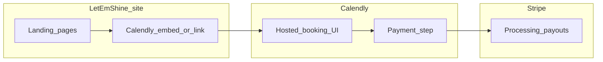

# Product Requirements Document: Let Em Shine

## Document information

| Field | Value |
|--------|--------|
| **Product** | Let Em Shine (teeth whitening) |
| **Version** | 2.0 |
| **Status** | Active — architecture direction updated |
| **Scope** | This repo’s marketing site + external booking/payments. [`DiamondDetailing/`](DiamondDetailing/) is unrelated legacy material. |

---

## 1. Executive summary

### 1.1 Direction (target operations)

**Booking and money run outside this codebase:**

- **Calendly** — scheduling, availability, reminders, and (optionally) calendar sync (e.g. Google Calendar).
- **Stripe** — connected to Calendly’s built-in payments so charges settle in **your Stripe account** (e.g. **$20 reservation fee** per business rules).

**This repository** is primarily a **marketing / brochure site** (React + Vite): brand, trust content, and a clear call-to-action into Calendly (embed and/or link). There is **no requirement for Supabase** (or any custom database) for production operations.

### 1.2 Problem statement

Clients need a frictionless way to book and pay a deposit; the owner needs reliable scheduling and payment records without maintaining custom backend booking logic.

### 1.3 Goals

| Goal | How |
|------|-----|
| Secure payments | Card data stays on Stripe’s rails (via Calendly flow); **no Stripe secret keys** in frontend code. |
| Low operational overhead | Single booking UX in Calendly; reconciliation in Stripe + Calendly. |
| Professional presence | Polished site retains Let Em Shine branding and routes visitors to book. |

### 1.4 Success metrics (initial)

- Booking completion rate (started vs completed with payment, per Calendly/Stripe reporting).
- No-show rate before/after deposit (tracked operationally).
- Owner time per week on scheduling and follow-ups.

---

## 2. Product vision

**One-liner:** A premium local teeth whitening brand online: discover on Let Em Shine’s site, **book and pay on Calendly + Stripe**, operate day-to-day from **Calendly and Stripe** (and synced calendar).

---

## 3. User personas

| Persona | Needs |
|--------|--------|
| **Client** | Clear service description, location/policy hints on site; seamless **schedule + pay deposit** on Calendly; confirmations/reminders from Calendly. |
| **Owner** | Upcoming appointments and notifications in **Calendly**; revenue, refunds, and payouts in **Stripe Dashboard**; optional calendar sync to avoid double-booking in real life. |

---

## 4. System architecture

### 4.1 Target architecture

- **System of record for appointments:** Calendly.
- **System of record for money:** Stripe (charges appear as usual; deposits/refunds per your policy).

### 4.2 Security model (what “good” looks like)

| Topic | Requirement |
|--------|----------------|
| **Frontend / marketing site** | Public content only. **Never** ship Stripe **secret** keys (`sk_live_…`), webhook secrets, or DB service keys in Vite/client bundles. |
| **Payments** | Customers complete payment in **hosted** Calendly/Stripe flows, not custom card forms on your domain. |
| **PCI** | Keeping card data off your servers by using Calendly + Stripe is appropriate for your scope. |
| **Future custom backend** | If you later add webhooks or automation, verify signatures **server-side** (serverless or host)—not in the browser. |

This avoids the anti-pattern of **trusting the browser** with secrets or sensitive business logic.

### 4.3 Optional future additions (not required for v1)

- Lightweight automation (e.g. Zapier/Make) for notifications or sheets — still **no** custom DB required.
- Optional **read-only** analytics elsewhere; Calendly + Stripe remain sources of truth.

---

## 5. Functional requirements

### 5.1 Public website (this repo)

| ID | Requirement |
|----|----------------|
| REQ-W1 | Preserve brand-forward landing experience (hero, services/story, gallery, testimonials, footer). |
| REQ-W2 | Replace custom embedded scheduler with **Calendly** (inline embed, popup widget, or prominent external link)—consistent with design. |
| REQ-W3 | Clear copy for **$60 service** vs **$20 reservation/deposit** as configured in Calendly/Stripe (avoid contradicting live checkout). |
| REQ-W4 | Mobile-friendly layout for embed/link. |

### 5.2 Booking & scheduling (Calendly)

| ID | Requirement |
|----|----------------|
| REQ-C1 | Owner configures availability, buffers, event types, and cancellation messaging in Calendly. |
| REQ-C2 | Event collects needed fields (name, email, phone if desired). |
| REQ-C3 | Reminders and reschedule flows use Calendly defaults unless business prefers overrides. |

### 5.3 Payments (Stripe via Calendly)

| ID | Requirement |
|----|----------------|
| REQ-P1 | Reservation fee amount and currency match business policy (e.g. **$20**). |
| REQ-P2 | Stripe account connected per Calendly’s integration; owner can issue **refunds** from Stripe when policy allows. |
| REQ-P3 | Owner monitors payouts, disputes, and exports from **Stripe Dashboard**. |

### 5.4 Email & notifications

| ID | Requirement |
|----|----------------|
| REQ-E1 | Confirmation and reminder emails **primarily via Calendly** (and Stripe receipts where applicable). |
| REQ-E2 | Optional: branded Calendly notifications settings reviewed for tone and policy links. |

### 5.5 Owner “dashboard”

| ID | Requirement |
|----|----------------|
| REQ-O1 | **Calendly** for schedule, invitee details, and cancellations. |
| REQ-O2 | **Stripe** for payment status, refunds, and accounting exports. |
| REQ-O3 | No obligation to maintain a custom admin SPA in this repo for v1. |

---

## 6. Repository evolution (current vs target)

### 6.1 Historical note — codebase today

The codebase **currently** includes Supabase-backed booking ([`src/components/SchedulingSection.tsx`](src/components/SchedulingSection.tsx)) and an admin area ([`src/admin/*`](src/admin/)). That reflected an earlier “custom DB + dashboard” approach.

### 6.2 Target codebase alignment

To match this PRD, engineering should:

1. **Remove or bypass Supabase** from user-facing flows — no booking inserts from the marketing site.
2. **Introduce Calendly** (embed URL or widget snippet from Calendly dashboard).
3. **Remove admin routes** (`/login`, `/admin/*`) **or** hide them behind feature flags / delete files once unused — owner ops live in Calendly + Stripe.
4. **Clean dependencies** — drop `@supabase/supabase-js` when fully removed.
5. **Update docs** — [`README.md`](README.md), [`src/README.md`](src/README.md), [`src/AI_SETUP_ASSISTANT.md`](src/AI_SETUP_ASSISTANT.md) should describe Calendly + env-free marketing deploy (no `VITE_SUPABASE_*`).

### 6.3 Out of scope for product v1

- Custom Postgres schema, RLS, or Supabase Auth for bookings.
- Native mobile apps.
- Full CRM — unless added later as a separate initiative.

---

## 7. Non-functional requirements

| Area | Requirement |
|------|----------------|
| **Hosting** | Static/Vite hosting (e.g. Vercel, Netlify, Cloudflare Pages) with HTTPS. |
| **Performance** | Landing remains fast; defer heavy third-party scripts per performance budget. |
| **Privacy** | Public privacy policy contact paths; align cookie/consent with embedded Calendly if required in your jurisdiction. |
| **Availability** | Business continuity tied to Calendly/Stripe SLAs; owner should know export habits for records. |

---

## 8. Phased roadmap

### Phase A — Platform setup (no code)

- Configure Calendly event(s), availability, and **Stripe connection** for paid bookings / deposit.
- Test full flow: book → pay → appear in Calendly + Stripe.

### Phase B — Website alignment (code)

- Swap scheduling section for Calendly embed/link; align pricing/deposit copy with live checkout.
- Remove Supabase usage and admin SPA per §6.2; simplify routing in [`src/App.tsx`](src/App.tsx).

### Phase C — Launch ops

- Custom domain, DNS, SSL.
- Spot-check mobile booking + payment.
- Document runbook for owner: refunds, reschedule, “what clients see.”

---

## 9. Open decisions

- **Deposit policy:** refundable window vs non-refundable — documented in Calendly description and enforced via Stripe refunds when needed.
- **Embed vs link:** inline embed (more seamless) vs button opening Calendly (simplest, fewer layout surprises).

---

## 10. Summary

The agreed direction is **Calendly + Stripe (Calendly-native payments to your Stripe account)** with **no Supabase** for operations. The Let Em Shine site’s job is to **convert visitors into that hosted booking/payment flow** safely—without putting secrets or payment logic in the frontend.
